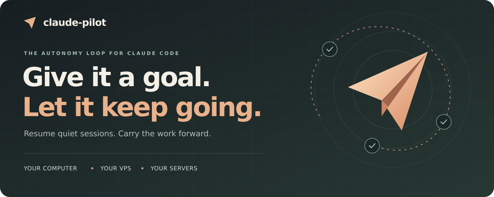
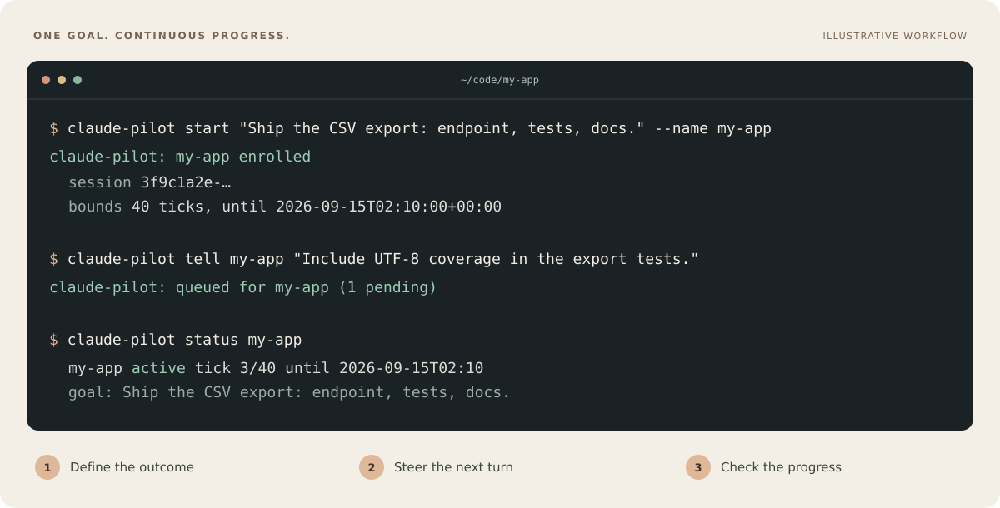
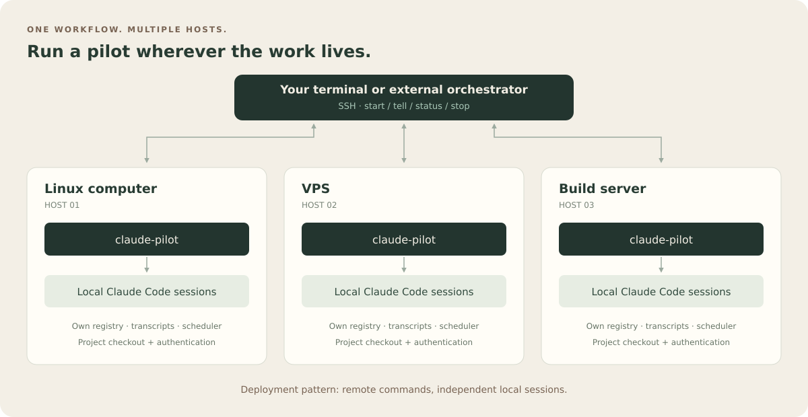
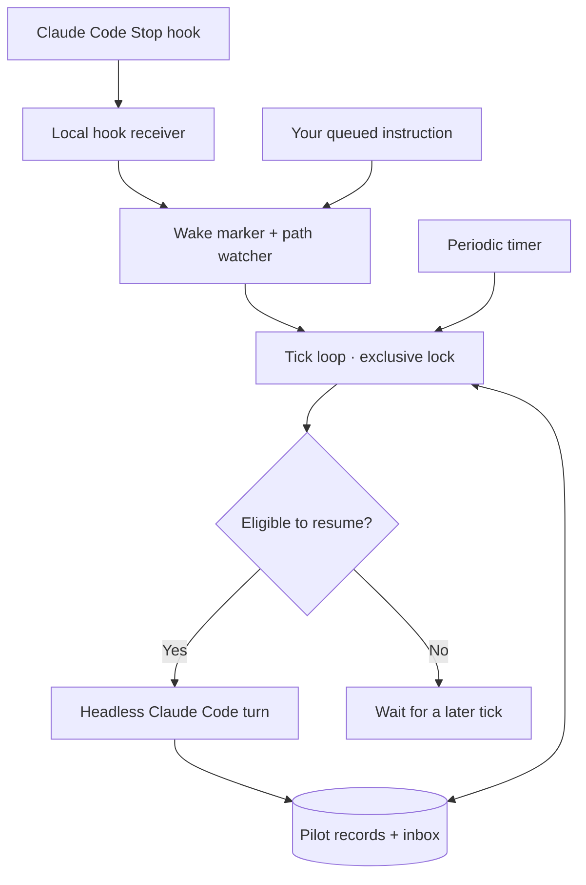
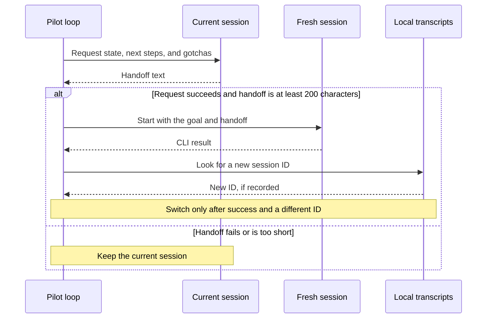

<p align="center">
  
</p>

<p align="center">
  <a href="pyproject.toml"></a>
  <a href="#quick-start"></a>
  <a href="pyproject.toml"></a>
  <a href="LICENSE"></a>
</p>

<h1 align="center">claude-pilot</h1>

<p align="center"><strong>Keep a Claude Code session working toward a goal while you are away.</strong></p>

<p align="center">
  <a href="#quick-start">Quick start</a> ·
  <a href="#how-is-this-different-from-goal">vs /goal</a> ·
  <a href="#computers-vps-and-multiple-servers">Multiple hosts</a> ·
  <a href="#how-it-works">How it works</a> ·
  <a href="#commands">Commands</a> ·
  <a href="#configuration">Configuration</a> ·
  <a href="#troubleshooting">Troubleshooting</a>
</p>

Give an existing session a clear goal. `claude-pilot` resumes it when it goes quiet, delivers instructions you queue along the way, and attempts a handoff to a fresh session when the transcript grows large. It records when the session reports completion, needs your help, or reaches its configured bounds.

One Python package. Standard library only. A Claude Code `Stop` hook for prompt wakeups, with a systemd timer as a fallback.

Run it on your Linux computer, a VPS, or several servers. Install a pilot on each host and control them through SSH or your own orchestration layer.

## Why use it?

| Keep work moving | Keep control |
| --- | --- |
| **Resume quiet sessions.** Continue toward the same goal across headless turns. | **Bound the loop.** Default limits of 40 ticks and 12 hours. |
| **Steer as you go.** Queue instructions without replacing the goal. | **Yield to your terminal.** An open interactive Claude session takes priority. |
| **Carry context forward.** Request a handoff before starting a fresh session. | **See the outcome.** Track status and plug in your own notifications. |

<p align="center">
  
</p>

*Illustrative workflow; commands are copyable below. The project name, session ID, dates, and progress vary by run.*

## Quick start

### 1. Install

You need **Linux**, **Python 3.11+**, and an installed, authenticated `claude` CLI. The setup below also uses Git, curl, and systemd user services. The interactive-session guard depends on Linux `/proc`.

```bash
git clone https://github.com/conrader/claude-pilot.git
cd claude-pilot
python3 -m venv .venv
source .venv/bin/activate
python -m pip install .

# Add /pilot to Claude Code.
mkdir -p ~/.claude/commands
cp contrib/claude-code/commands/pilot.md ~/.claude/commands/pilot.md
```

Keep this checkout and its virtual environment in place: the generated services use the installed executable's path. Activate the same environment when using `claude-pilot` in another shell.

Already have your own Python environment? Install directly with `python -m pip install git+https://github.com/conrader/claude-pilot.git`; copy the [slash command](contrib/claude-code/commands/pilot.md) separately if you want `/pilot`.

### 2. Connect the Stop hook

Merge this into `~/.claude/settings.json`, preserving your existing settings and hooks. The same snippet is available in [settings-hooks.json](contrib/claude-code/settings-hooks.json).

```json
{
  "hooks": {
    "Stop": [
      {
        "hooks": [
          {
            "type": "command",
            "command": "[ -n \"$CLAUDE_PILOT_TICK\" ] || { cat | curl -s -m 3 -X POST -H 'Content-Type: application/json' --data-binary @- http://127.0.0.1:8910/hook >/dev/null 2>&1 || true ; }"
          }
        ]
      }
    ]
  }
}
```

`CLAUDE_PILOT_TICK` prevents headless turns from waking themselves. The short timeout and `|| true` let your session continue if the receiver is unavailable.

### 3. Start the services

```bash
claude-pilot install-units --write
systemctl --user enable --now \
  claude-pilot-hookd.service \
  claude-pilot.timer \
  claude-pilot-wake.path

# Confirm the hook receiver is responding.
curl -fsS http://127.0.0.1:8910/health
# ok
```

The installer writes **five unit files** to `~/.config/systemd/user/` and requests a daemon reload.

| Unit | Purpose |
| --- | --- |
| `claude-pilot-hookd.service` | Receive Stop events; create wake markers for matching active pilots. |
| `claude-pilot-wake.path` | Watch for wake markers. |
| `claude-pilot-wake.service` | Run a tick when the path watcher fires. |
| `claude-pilot.timer` | Schedule periodic ticks, with a 10-minute interval. |
| `claude-pilot.service` | Run a tick when the timer fires. |

**No systemd?** Run `claude-pilot hookd` under your supervisor and schedule `claude-pilot tick` with cron. The periodic tick consumes wake markers too; immediate wakeups need a separate watcher. Tick execution is locked against overlapping schedulers.

> [!IMPORTANT]
> The computer or VPS running the pilot must remain awake. Your own laptop can disconnect when the pilot runs on another host. For work after logout, the host's systemd user manager must remain running too; where permitted, `loginctl enable-linger "$USER"` enables that. The services also need access to your Claude authentication and executable. If `claude` is outside their PATH, set `agent_command` to its absolute path in [configuration](#configuration).

### 4. Give it a goal

Open Claude Code in the project you want to work on. Let it make at least one tool call so a transcript exists, then run:

```text
/pilot Ship the CSV export: endpoint, tests, docs. Do not touch billing.
```

When you want the background loop to take over, exit the interactive Claude session after the current work finishes. **Leaving it open in a terminal makes the pilot wait.**

You can also enroll the newest recorded session from your shell:

```bash
cd ~/code/my-app
claude-pilot start \
  "Ship the CSV export: endpoint, tests, docs. Do not touch billing." \
  --name my-app --ticks 40 --hours 12

claude-pilot tell my-app "Include UTF-8 coverage in the export tests."
claude-pilot status my-app
```

> [!NOTE]
> Headless turns default to `permission_mode: "bypassPermissions"`, which bypasses Claude Code permission prompts. Set the mode deliberately before running a pilot. Goals and `CLAUDE.md` guide the model; they are not an execution sandbox. Other permission modes can leave unattended work waiting for approval.

## How is this different from `/goal`?

Claude Code ships `/goal <condition>`: after every turn a small model judges whether the condition holds and, if not, the session takes another turn. It is the right tool when you are still at the keyboard, and it needs no setup. `claude-pilot` solves a different problem: the work has to continue after the session, the terminal and possibly the machine you typed on are gone.

| | `/goal` (built in) | `claude-pilot` |
| --- | --- | --- |
| Where the loop runs | Inside the live session process | Outside it: a scheduler resumes the session headlessly |
| Survives closing the terminal | Only while the session process is alive | Yes; the session is resumed by id from its transcript |
| Runs on a server with nobody logged in | No | Yes, from systemd or cron, on one host or many |
| Judges whether the goal is met | Yes, an evaluator model after every turn | No; the session reports `PILOT-DONE`, you or your own supervisor verify |
| Bounds | A clause in the condition, e.g. "or stop after 20 turns" | Ticks and hours, enforced outside the model, plus a concurrency cap |
| Steering mid-run | Type in the session | `claude-pilot tell` from any shell or script, delivered on the next resume |
| Context growth | Auto-compaction inside the session | Handoff to a fresh session with a written summary once the transcript is large |
| Waking on events | Turn-driven | Stop hook wakes it instantly; a timer covers everything else |
| Notifications | On screen | Any command: chat bot, mail, webhook |
| Setup | None | A hook, three units, a config file |

They compose. Start a pilot around a session that also carries a `/goal`: the built-in evaluator drives the turns while you are present, and the pilot takes over when the session goes quiet or ends. The pilot's own check is deliberately dumb: it trusts the reply markers and leaves judgement to you or to whatever supervisor you plug in through `notify_command` and the state files.

## Computers, VPS, and multiple servers

The same setup works on a Linux workstation, an always-on VPS, or several servers with different projects. Install and authenticate Claude Code on each execution host, then install `claude-pilot` there. Each host owns its sessions, transcripts, registry, and scheduler.

<p align="center">
  
</p>

From one terminal, you can steer work on different machines:

```bash
# Example SSH hosts and install paths; replace with your own.
ssh dev-vps '~/tools/claude-pilot/.venv/bin/claude-pilot status'
ssh build-server '~/tools/claude-pilot/.venv/bin/claude-pilot tell my-app "Run the export tests next."'
ssh dev-vps '~/tools/claude-pilot/.venv/bin/claude-pilot stop my-app'
```

This is a deployment pattern built from **one installation per host** and an external control layer such as SSH. The current package does not provide a built-in fleet scheduler, shared cross-host registry, or automatic migration of a running session between machines. Its context handoffs start a fresh session on the same host. Use your existing repository workflow to move code between hosts.

## How it works

### Two triggers, one loop



Each tick examines enrolled pilots in order. Before resuming one, it checks its state and bounds, yields to an interactive Claude process, and applies liveness and idle-backoff rules. The resume prompt includes the goal, current bounds, standing instructions, and queued messages.

| Signal | What the loop does |
| --- | --- |
| Interactive Claude session in the project | Wait, even if a wake marker exists. |
| Fresh transcript activity without a wake marker | Wait; the default quiet window is 8 minutes, including subagent transcripts. |
| Stop hook or `tell` wake marker | Bypass the quiet-window and idle-backoff checks, while still honoring the interactive guard and bounds. |
| Quiet session with no new input | Resume on the first eligible idle tick, then back off; default `idle_backoff` is 6. |
| Failed resume after draining instructions | Put those instructions back in the inbox. |

### A fresh session, with a handoff

After a successful continuing turn, the loop estimates transcript tokens. At the default threshold of **150,000**, it attempts this handoff:



This is a text-based handoff, using an approximate token count. If the fresh turn fails or no different session ID is found, the pilot keeps its original session reference. See [driver.py](claude_pilot/driver.py) and [sessions.py](claude_pilot/sessions.py).

### Clear outcomes

| Outcome | Pilot state | Next step |
| --- | --- | --- |
| Reply contains `PILOT-DONE` | `done` | Review the delivered work. |
| Reply contains `PILOT-BLOCKED` | `blocked` | Supply what is missing, then `revive`. |
| Deadline reached | `expired` | `revive` extends an elapsed deadline. |
| Tick budget reached | `exhausted` | `revive` starts a fresh tick budget. |
| Resume fails | `error` | Inspect the last reply, fix the cause, then `revive`. |
| You run `stop` | `stopped` | Re-arming requires explicit `--force`. |

Completion and blocking are **reported by the model**. The loop recognizes reply markers; it does not independently verify the implementation. Normal successful replies keep the pilot active. A detected background-agent conflict also keeps it active and does not spend a tick.

Notifications go to stdout and, when configured, your `notify_command`. Identical messages are deduplicated for ten minutes.

## Commands

| Command | What it does |
| --- | --- |
| `claude-pilot start "<goal>"` | Enroll the newest transcript in the current project. Supports `--name`, `--cwd`, `--session-id`, `--ticks`, `--hours`, `--persistent`, `--force`, and `--allow-more`. |
| `claude-pilot tick` | Run one pass over enrolled pilots. |
| `claude-pilot status [name]` | Show state, tick count, deadline, goal, and the latest recorded reply. |
| `claude-pilot tell <name> "<text>"` | Queue an instruction and create a wake marker. |
| `claude-pilot inbox <name>` | Show pending instructions. `--drain` marks them consumed. |
| `claude-pilot goal <name> "<text>"` | Replace the goal without resetting ticks or deadline; also reactivate a done, blocked, errored, expired, or exhausted pilot. |
| `claude-pilot stop <name>` | Mark a pilot stopped to prevent future resumes. |
| `claude-pilot revive <name>` | Reactivate an existing pilot; extend an elapsed deadline; reset the tick budget if it was exhausted. Supports `--hours`, `--persistent`, `--force`, and `--allow-more`. |
| `claude-pilot hookd` | Run the hook receiver in the foreground; supports `--port` and `--bind`. |
| `claude-pilot install-units [--write]` | Print the systemd units, or install them. |

Inside Claude Code, use `/pilot <goal>`, `/pilot status`, or `/pilot stop`.

By default, `start` requires a project directory with `.git` or a recognized manifest, plus an existing transcript. The active-pilot cap is **3**. Refusals explain why enrollment could not proceed.

<details>
<summary><strong>Bounds, recovery, and persistent pilots</strong></summary>

- Bounds are checked before resuming; the deadline does not interrupt a turn already running. `resume_timeout_s` limits each CLI invocation.
- The tick budget counts resume attempts, not tokens or money. Handoff calls can add model turns beyond that count.
- `revive` preserves the tick counter, except for an exhausted pilot, which gets a fresh budget. Changing a goal preserves the existing bounds.
- `--persistent` renews elapsed deadlines and resets exhausted tick counters. It can still finish, block, or error; it does not override `stop`.
- Recognized usage-limit errors are retried after at least 60 minutes. That recovery can extend an elapsed deadline, but does not clear an exhausted tick counter.
- `stop` updates the record; it is not a process-kill command. Let an in-flight tick finish, then confirm the state with `status`.

</details>

## Configuration

Create `~/.config/claude-pilot/config.json`. Every key is optional; environment variables named `CLAUDE_PILOT_<KEY>` override file values, which override built-in defaults.

<details>
<summary><strong>Show all defaults</strong></summary>

```json
{
  "agent_command": "claude",
  "model": "",
  "permission_mode": "bypassPermissions",
  "idle_minutes": 8,
  "idle_backoff": 6,
  "default_ticks": 40,
  "default_hours": 12,
  "cap": 3,
  "compact_tokens": 150000,
  "resume_timeout_s": 3600,
  "notify_command": "",
  "hookd_port": 8910,
  "hookd_token_file": "~/.config/claude-pilot/hookd.token"
}
```

</details>

| Setting | Use it to… |
| --- | --- |
| `agent_command` | Point to your Claude executable, using an absolute path when needed by systemd. |
| `model` / `permission_mode` | Forward model selection and permission mode to each headless turn. |
| `idle_minutes` / `idle_backoff` | Control quiet-session detection and how often idle pilots resume. |
| `default_ticks` / `default_hours` / `cap` | Set default enrollment bounds and the active-pilot cap. |
| `compact_tokens` / `resume_timeout_s` | Set the handoff threshold and per-invocation timeout. |
| `notify_command` | Run your notification command with the message on stdin. |
| `hookd_port` / `hookd_token_file` | Configure the receiver port and optional off-loopback authentication. |

For example, to use desktop notifications where `notify-send` and a desktop session are available:

```json
{
  "notify_command": "xargs -0 notify-send 'claude-pilot'"
}
```

Without a token file, the receiver defaults to `127.0.0.1`. If a nonempty token file is present, its default bind address becomes `0.0.0.0`, and off-loopback requests require a matching `X-Pilot-Token` header. Change the hook URL too if you change the port.

| Path override | Default |
| --- | --- |
| `CLAUDE_PILOT_HOME` | `~/.local/state/claude-pilot/`: records, inboxes, events, wake markers, and lock. |
| `CLAUDE_PILOT_CONFIG` | `~/.config/claude-pilot/config.json` |
| `CLAUDE_PROJECTS_DIR` | `~/.claude/projects/`: Claude Code transcripts. |

Shell environment overrides apply to commands started from that shell. For systemd services, use the JSON config or explicitly configure their environment.

## Troubleshooting

| Symptom | Check |
| --- | --- |
| “No transcript recorded” | Open Claude in the target directory and let it make a tool call before enrolling. |
| Pilot stays active but does not resume | Exit an open interactive Claude session; inspect the quiet window and idle backoff. |
| `claude` works in your shell but fails under systemd | Set `agent_command` to the full path returned by `command -v claude`. Confirm authentication is available to the service user. |
| Stop hooks do not wake the pilot | Check `/health`, the hook settings, and `claude-pilot-wake.path`. |
| Instructions wait on a blocked pilot | `tell` queues input but does not reactivate the pilot; run `revive` after supplying the missing information. |

```bash
claude-pilot status
systemctl --user status \
  claude-pilot-hookd.service claude-pilot.timer claude-pilot-wake.path
journalctl --user \
  -u claude-pilot.service -u claude-pilot-wake.service \
  -u claude-pilot-hookd.service -n 80 --no-pager
```

## Design notes

**Transcript activity is the liveness signal.** Without a wake marker, recent writes to the session or its subagent transcripts mean the loop leaves it alone. A Stop hook accelerates scheduling; a human's interactive terminal still takes priority.

**Scheduling must survive duplicate triggers.** A file lock serializes ticks. Wake markers are consumed before state checks, and orphaned markers are removed so a path watcher cannot restart forever.

**Operator input must survive a failed turn.** Drained inbox messages are put back if the resume fails. Idle backoff never delays a wake marker or pending instruction, though the other guards still apply.

**The goal defines the work.** Each resume asks the model to stay in scope, finish verified and committed steps, read state back, and report `PILOT-DONE` only for completed work. Those prompts live in [instruction.py](claude_pilot/instruction.py).

Each instance manages Claude Code sessions on its execution host; [multiple hosts](#computers-vps-and-multiple-servers) can be controlled through an external layer. The package does not include a Codex driver or a supervisor that evaluates whether the work is on goal.

## Development

From your activated virtual environment in the checkout:

```bash
python -m pip install -e . pytest
python -m pytest -q
```

The application uses only the Python standard library; pytest is a development dependency. Tests cover the CLI, configuration, session discovery, driver, hooks, registry, instructions, notifications, and tick loop. Source files stay under 500 lines by project convention.

Issues and pull requests are welcome. Include the observed behavior and relevant `claude-pilot status` output; remove private goals, paths, and credentials before sharing logs.

## License

[MIT](LICENSE) · Built by [Konrad Sierzputowski](https://github.com/conrader).
